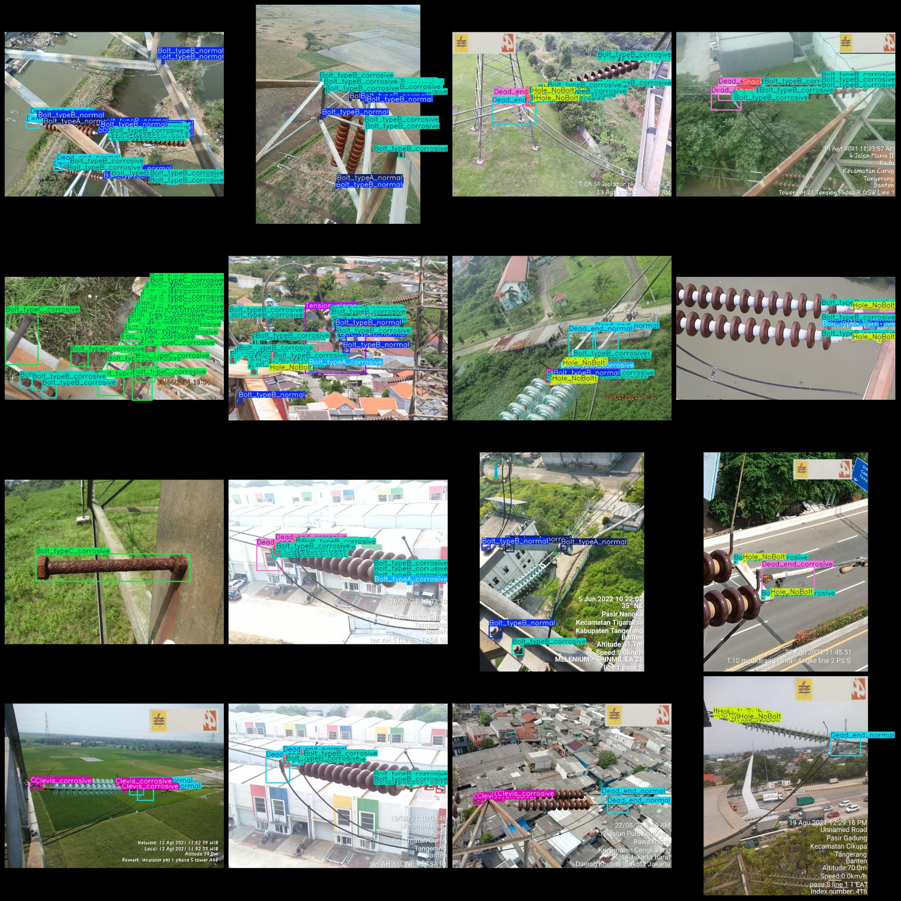
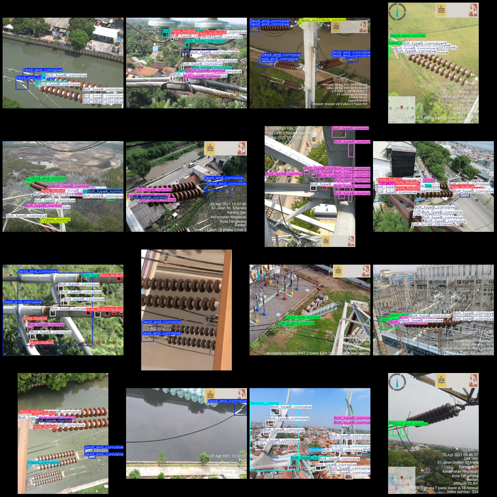

# Power Scenery Screw Rust, Hanger Rust, Ring Rust, Tensile Clamp Rust Detection Data Set in VOC+YOLO Format with 1576 Images and 14 Categories

Dataset format: Pascal VOC format + YOLO format (excluding split paths in txt files, containing only jpg images and corresponding VOC format xml files and yolo format txt files)
Number of images (jpg file count): 1576
Number of annotations (xml file count): 1576
Number of annotations (txt file count): 1576
Number of annotation categories: 14
Annotation category names (note that the order of categories in the yolo format does not correspond to this list, but is based on the labels folder's classes.txt): ["Bolt_typeA_corrosive", "Bolt_typeA_normal", "Bolt_typeB_corrosive", "Bolt_typeB_normal", "Bolt_typeC_corrosive", "Bolt_typeC_normal", "Clevis_corrosive", "Clevis_normal", "Dead_end_corrosive", "Dead_end_normal", "Hole_NoBolt", "Shackle_corrosive", "Shackle_normal", "Tension_clamp"]
Box counts for each category:
Bolt_typeA_corrosive = 993
Bolt_typeA_normal = 485
Bolt_typeB_corrosive = 10180
Bolt_typeB_normal = 4320
Bolt_typeC_corrosive = 1162
Bolt_typeC_normal = 506
Clevis_corrosive = 805
Clevis_normal = 559
Dead_end_corrosive Frame Count = 982
Dead_end_normal box count = 923
Hole_NoBolt Frame Count = 3291
Shackle_corrosive frame count = 902
Shackle_normal box count = 650
Tension_clamp Frames = 267
Total frames: 26,025
Image resolution: 640x640
Use labelImg
Rules for annotation: Draw a rectangle around the category.
Important notes: None.
Special Disclaimer: This dataset does not guarantee the accuracy of the trained models or weight files.
Preview of the image:
## Images

Here is a pay link on Stripe ( https://buy.stripe.com/3cs8yP7sY87d0vu9AB ). Please contact me lonlonago@foxmail.com after funding $89, and I will send you a complete data files , thank you!

